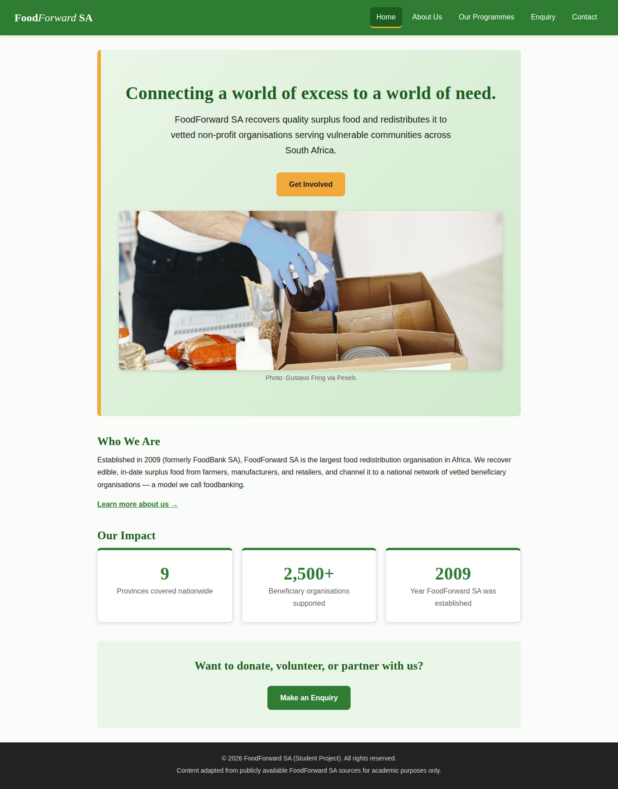
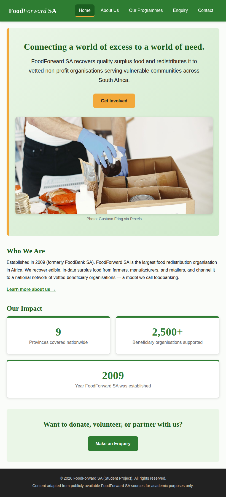
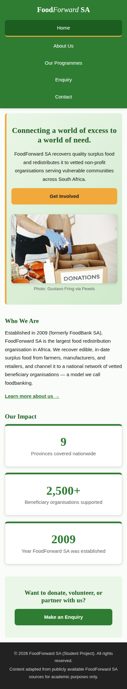
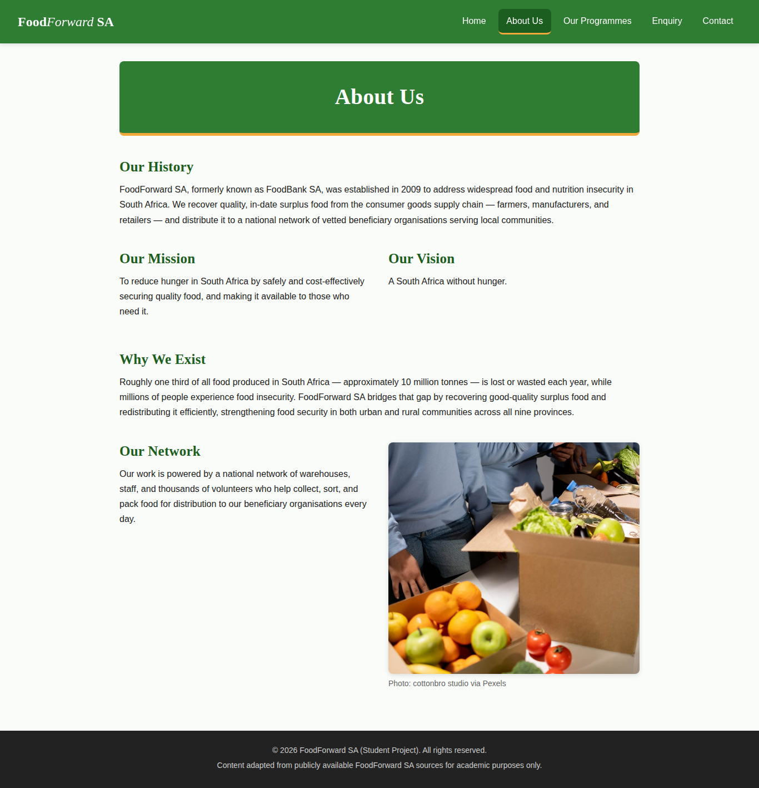
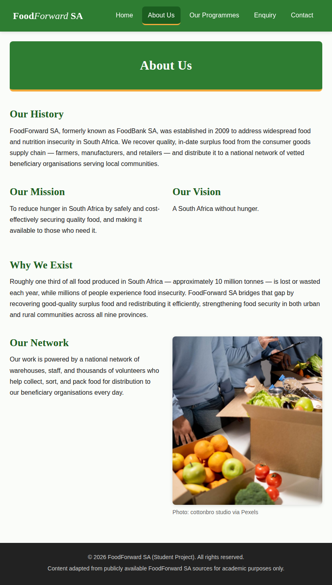
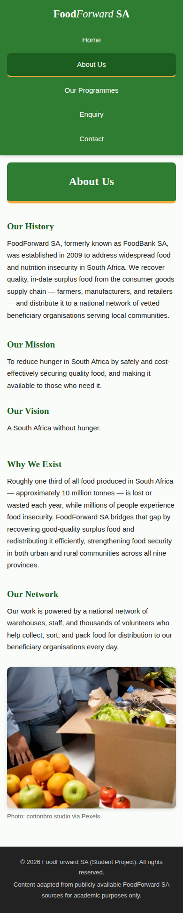
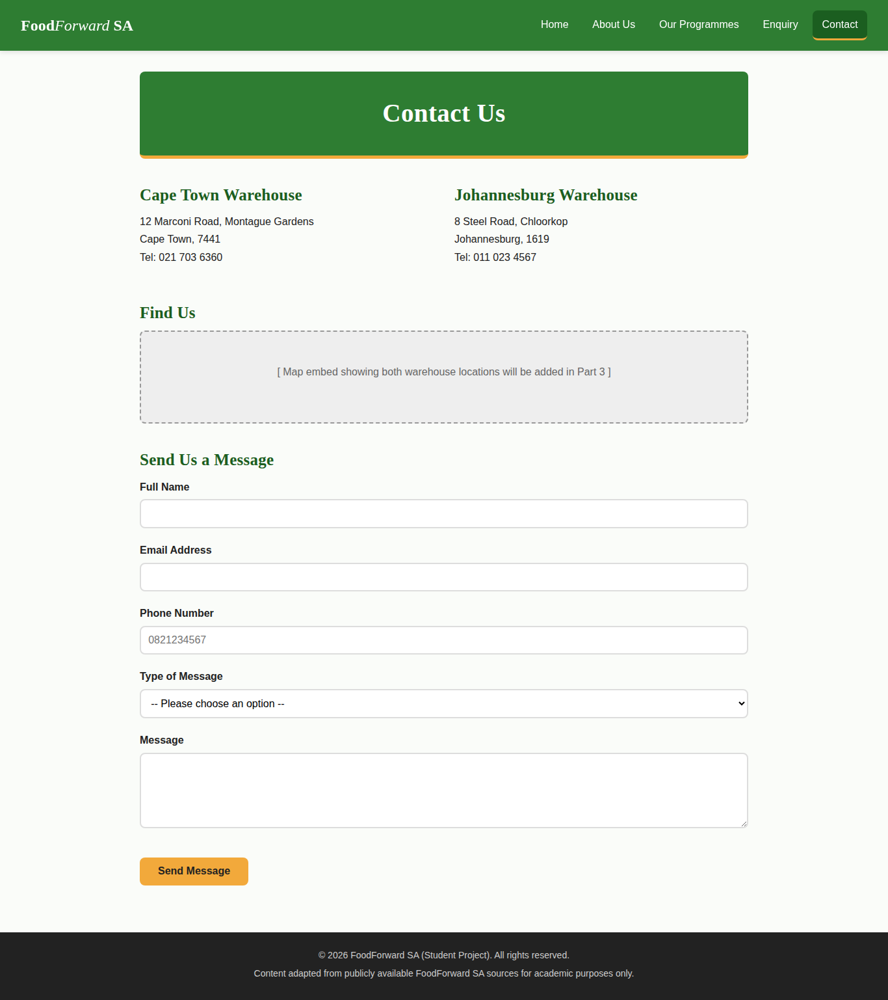
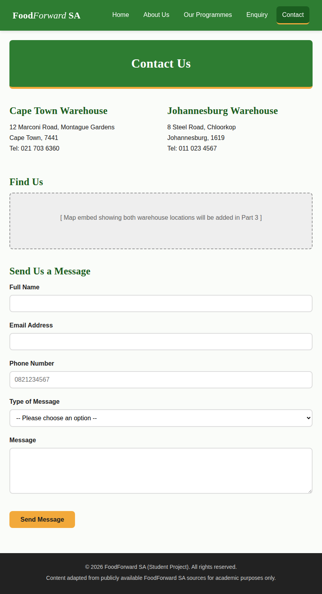
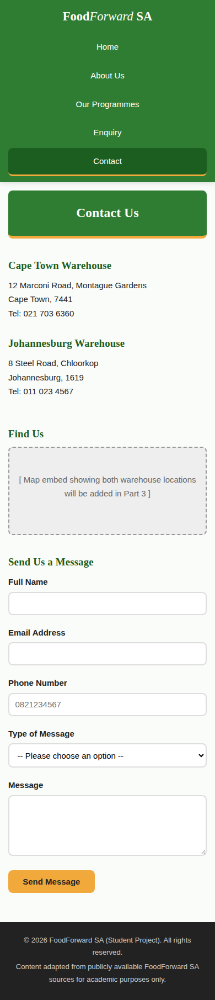

# FoodForward SA — Website Project

## Project Title
FoodForward SA: Foodbanking Website

## Student Information
- **Name:** Sihlengiwe Mbhele
- **Student Number:**ST10523711
- **Module:** WEDE5020

## Project Overview
This project is a five-page website built for FoodForward SA, South
Africa's largest food redistribution non-profit organisation. Established
in 2009 (formerly FoodBank SA), FoodForward SA recovers quality surplus
food from farmers, manufacturers, and retailers, and redistributes it to
a national network of vetted beneficiary organisations across all nine
provinces &mdash; a model known as foodbanking.

The project is being developed in three parts:
- **Part 1:** Planning, research, and static HTML structure (complete).
- **Part 2:** CSS styling and responsive design (current stage).
- **Part 3:** JavaScript functionality, SEO, forms, and deployment.

## Website Goals and Objectives
- Increase awareness of food waste and food insecurity in South Africa.
- Encourage food, corporate, and individual donations.
- Grow the volunteer base and beneficiary organisation network.
- Provide a simple enquiry channel for volunteers, donors, and prospective
  partner organisations.

## Key Features and Functionality
- Five core pages: Home, About Us, Our Programmes, Enquiry, Contact.
- Consistent header navigation and footer across every page.
- Volunteer/donor/partner enquiry form (`enquiry.html`).
- General contact form with multiple warehouse locations (`contact.html`).
- (Part 2) Fully responsive desktop, tablet, and mobile layouts.
- (Part 3) JavaScript form validation, interactive elements, embedded map,
  and SEO optimisation.

## Timeline and Milestones
| Part | Focus | Status |
|------|-------|--------|
| Part 1 | Planning, proposal, HTML structure | Complete |
| Part 2 | CSS styling, responsive design | In progress |
| Part 3 | JavaScript, SEO, forms, deployment | Not started |

## Sitemap
See `docs/sitemap.svg` / `docs/sitemap.png` for the full visual sitemap.

```
Home (index.html)
├── About Us (about.html)
├── Our Programmes (services.html)
├── Enquiry (enquiry.html)
└── Contact (contact.html)
```

## File and Folder Structure
```
foodforwardsa/
├── index.html
├── about.html
├── services.html
├── enquiry.html
├── contact.html
├── css/
│   └── style.css
├── js/
├── images/
│   ├── donation-box-small.jpg / donation-box-large.jpg
│   └── volunteers-food-sorting-small.jpg / volunteers-food-sorting-large.jpg
├── docs/
│   └── sitemap.svg / sitemap.png
├── screenshots/
│   └── responsive test screenshots (Part 2)
└── README.md
```

## Part 1 Details
- Selected target organisation: FoodForward SA (NPO category), with BRAC
  South Africa researched as the alternative/backup proposal.
- Two project proposals submitted for lecturer approval (see
  `Website_Project_Proposal.docx`).
- Five HTML pages created using semantic HTML5 elements (`header`, `nav`,
  `main`, `footer`, `section`).
- Basic starter CSS added for a readable Part 1 preview (full styling to
  follow in Part 2).
- Navigation menu implemented and functional across all five pages.

## Part 2 Details
### Feedback from Part 1
- Do the work on my own and not rely on AI for everything.

### External stylesheet
- One external stylesheet `css/style.css` is linked in the `<head>` of all five pages.
- A CSS reset removes browser default margins/padding and sets `box-sizing: border-box`.
- Design tokens (colours, font scale, radius, shadow) are stored as CSS custom properties in `:root`, so the look can be changed in one place.

### Typography
- Headings use Georgia (serif) and body text uses Segoe UI (sans-serif).
- A type scale (0.875rem to 2.441rem) gives consistent heading sizes.
- `line-height`, `font-weight` and `letter-spacing` are for easier readability.

### Layout
- **Flexbox:** header and navigation, and the impact cards.
- **CSS Grid:** the two-column mission/vision and warehouse location sections.
- Content is centred in `main`.

### Decoration and colour
- Palette: dark green `#1B5E20`, green `#2E7D32`, light green `#EAF6E7`, orange accent `#F2A93B`.
- Borders, `border-radius` and `box-shadow` are used on cards, banners, hero and forms.

### Pseudo-classes
- `:hover`, `:focus` and `:active` on navigation links, buttons, cards and form fields.
- `:focus-visible` gives a clear keyboard focus outline for easier accesibility.
- `:user-valid` and `:user-invalid` show form field feedback after the user interacts.

### Responsive design
| Breakpoint | Changes |
|------------|---------|
| Desktop (above 1024px) | Horizontal navigation, three impact cards in a row, two-column sections |
| Tablet (1024px and below) | Smaller headings and padding, impact cards wrap |
| Mobile (600px and below) | Navigation stacks vertically, single-column layout, smaller base font, full-width buttons |

- Relative units (`rem`, `em`, `%`) are used for font sizes and spacing.
- Images use `max-width: 100%; height: auto;` so they scale inside their containers.
- `prefers-reduced-motion` is respected for users who don't want animations.

### Images
- Two free-to-use stock photos from Pexels (see References) were resized to small and large versions to reduce loading time.
- `index.html` hero image uses `srcset` and `sizes` so the browser loads the 600px or 1200px file depending on screen size.
- `about.html` uses the `<picture>` element: the small file is served on screens of 600px or less, and the large file on bigger screens.
- Images use `max-width: 100%`, `object-fit: cover` and descriptive `alt` text.

### Responsive screenshots
| Page | Desktop | Tablet | Mobile |
|------|---------|--------|--------|
| Home |  |  |  |
| About |  |  |  |
| Contact |  |  |  |

### Testing
- Tested in Chrome DevTools device mode at desktop (1366px), tablet (820px) and mobile (390px) widths.
- No horizontal scrolling at any tested width.

## Changelog
- **[31 August 2026]** — Initial repository setup: file/folder creation
  (css, js, images, docs).
- **[31 August 2026]** — Added index.html, about.html, services.html, enquiry.html,
  and contact.html with semantic HTML5 structure and code comments.
- **[31 August 2026]** — Added enquiry and contact forms with basic HTML5 validation
  attributes (required, minlength, pattern).
- **[1 September 2026]** — Added sitemap diagram and basic starter stylesheet.
- **[1 September 2026]** — Added README with project overview, goals, and references.
- **[6 October 2026]** — Part 1 feedback: I was meant to do my work on my own and not rely so heavily on AI to do it for me and I did just that in the sense that I did use AI to help me but not rely on it to do the assignment for me.
- **[6 October 2026]** — Rebuilt `css/style.css` from the Part 1 starter into a full stylesheet: CSS reset, `:root` design tokens, typography scale and base styles.
- **[6 October 2026]** — Added desktop layout using Flexbox (header, nav, impact cards) and CSS Grid (two-column sections).
- **[6 October 2026]** — Added decoration and colour styles: borders, border-radius, box-shadow, hero gradient and page banners.
- **[6 October 2026]** — Added `:hover`, `:focus`, `:focus-visible` and `:active` styles for links, buttons, cards and form fields, plus `:user-valid`/`:user-invalid` form feedback.
- **[6 October 2026]** — Added tablet (1024px) and mobile (600px) media queries: stacked navigation, single-column layouts, adjusted font sizes and full-width buttons.
- **[6 October 2026]** — Added two Pexels photos to `images/`, resized into small and large versions with descriptive file names.
- **[6 October 2026]** — Added a hero image to `index.html` using `srcset` and `sizes`, and a volunteer photo to `about.html` using the `<picture>` element, with alt text and photo credits.
- **[6 October 2026]** — Added image and caption styles (`object-fit`, `max-width`, `border-radius`) and smaller image heights for mobile.
- **[6 October 2026]** — Added responsive testing screenshots to the `screenshots/` folder and a responsive section to the README.

## References
FoodForward SA (2026) *About us*. Available at:<
https://www.foodforwardsa.org/about-us/> [Accessed: 2 September 2026].

BRAC International (2026) *Vision, mission, and values*. Available at:<
https://www.bracinternational.org/about-us/vision-mission-values/>
[Accessed: 2 September 2026].

BRAC (2026) *South Africa*. Available at:<
https://www.brac.net/global-impact/south-africa/ >[Accessed: 2 September
2026].

cottonbro studio (2026) *Boxing foods for aid distribution*. Available at:< https://www.pexels.com/photo/boxing-foods-for-aid-distribution-6591166/> [Accessed: 6 October 2026].

Fring, G. (2026) *A person packing donations*. Available at:< https://www.pexels.com/photo/7156158/> [Accessed: 6 October 2026].


## AI Disclosure
Disclosure of AI Usage in my Assessment

Section(s) where AI was used:

WEDE5020 PoE Part 2
css/style.css
index.html and about.html (responsive images)
README.md (Part 2 details and changelog)
screenshots/ folder

AI tool used:

Claude (Sonnet 5.5), Anthropic, via claude.ai
In-text citation: (Anthropic, 2026)
Reference: Anthropic (2026) Claude Sonnet 5.5 [Large language model]. Available at:< https://claude.ai> [Accessed: 6 October 2026].

Purpose of use:
Asked for step by step set up and gude on how to continue from part 1.
Resizing Pexel images accordingly.

Date of AI use:

6 October 2026

Chat evidence:

Screenshots linked
